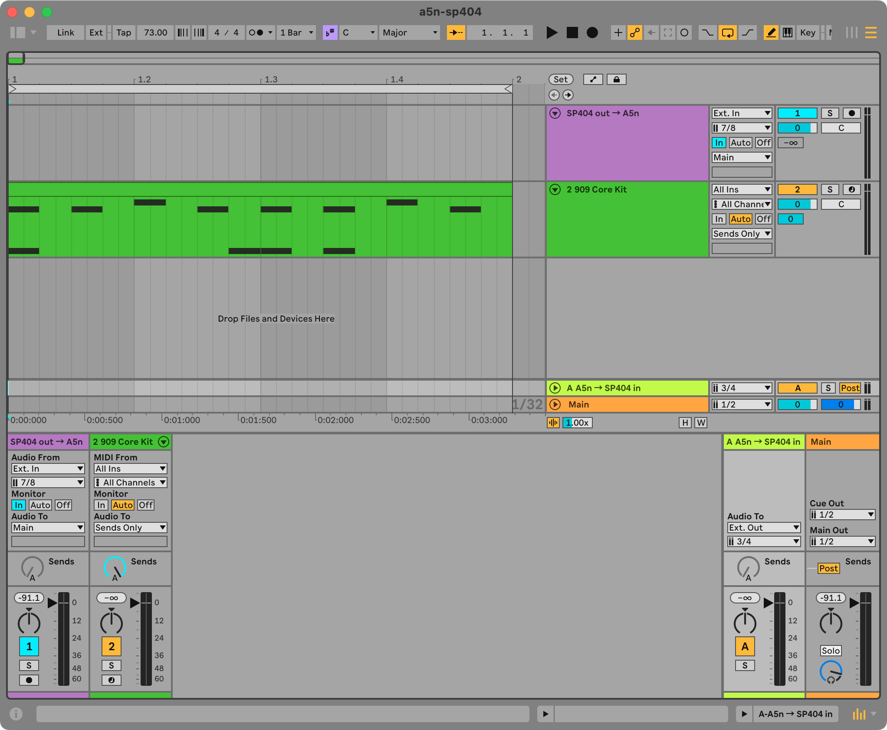

# a5n-sp404

## About

This is how I connect my [Roland SP-404MKII](https://www.roland.com/global/products/sp-404mk2) to Ableton Live 12 Intro so I can use it as an external effects widget.

## Screenshot

## References

* [Using external audio effects](https://help.ableton.com/hc/en-us/articles/360005113200-Using-external-audio-effects)
